# Bitácora Laboratorio 3 — CrowdStrike Incident Hub

**Equipo:** Andrés Camilo Vivas Baquero (Red Team) · Johan Sebastián Beltrán Gutiérrez (Blue Team / Builder)
**Grupo:** G07 · **Temática:** Opción 1 — Automatización de incidentes de CrowdStrike Falcon
**Fecha:** 2026-09-16 (horas en UTC)

Publicamos el prototipo "CrowdStrike Incident Hub" por HTTP, sin autenticación, y corrimos el ciclo completo que pide la guía: construir, modelar, atacar, detectar, corregir y verificar. Esta bitácora junta lo que hicimos en orden, con la evidencia real y algunas capturas de pantalla que tomamos en el momento.

---

## 1. Entorno

Montamos las dos VMs en VMware Workstation, en la misma máquina, conectadas por red NAT:

| Componente | Detalle |
|---|---|
| Blue Team / Builder | Ubuntu Server LTS, host `lab3ubuntu`, IP `192.168.92.132` |
| Red Team | Kali Linux (imagen VMware oficial), IP `192.168.92.134` |
| Servicio | Nginx 1.28.3, puerto 80/TCP, sin TLS, sin autenticación |

Línea base ([`evidence/blue/00-baseline.txt`](evidence/blue/00-baseline.txt)):
```
Static hostname: lab3ubuntu
Operating System: Ubuntu 26.04.1 LTS
ens33  192.168.92.132/24
Timestamp UTC: 2026-09-16T19:08:08Z
```

Un detalle de instalación: el instalador ISO de Kali nos falló varias veces al descargar paquetes (error de checksum leyendo el propio ISO montado en la VM). Cambiamos a la imagen VMware ya armada que ofrece Kali oficialmente y de ahí en adelante no hubo más problemas.

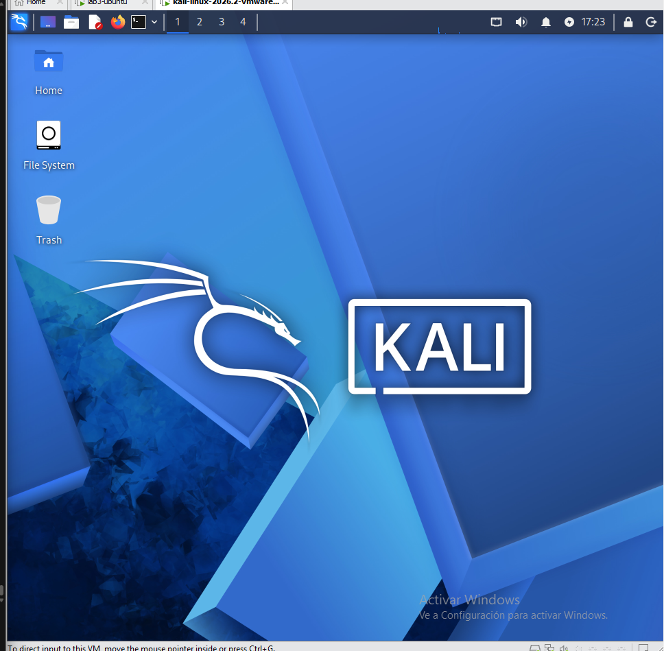

---

## 2. Construir y publicar

```bash
bash scripts/00-verify-host.sh
bash scripts/01-deploy-nginx.sh
```

La primera vez que probamos con `curl` local, en vez del sitio salió la página por defecto de Nginx ("Welcome to nginx!"). El archivo de configuración estaba bien copiado, `nginx -t` no marcaba errores, pero `systemctl reload nginx` no estaba aplicando el nuevo virtual host. Tocó usar `systemctl restart nginx` para que sí tomara el cambio.

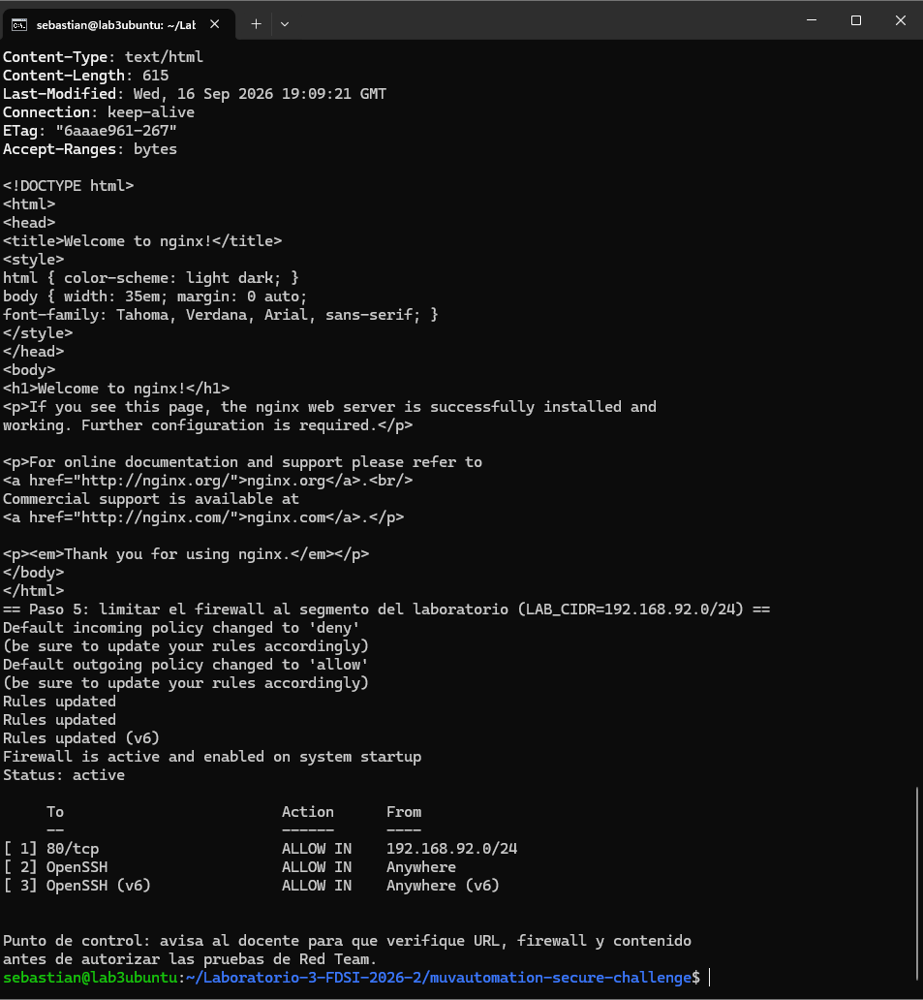

La misma captura sirve para confirmar el firewall: `ufw` quedó activo, limitando el puerto 80 a la subred `192.168.92.0/24` y dejando abierto OpenSSH, como pide el paso 5 de la guía.

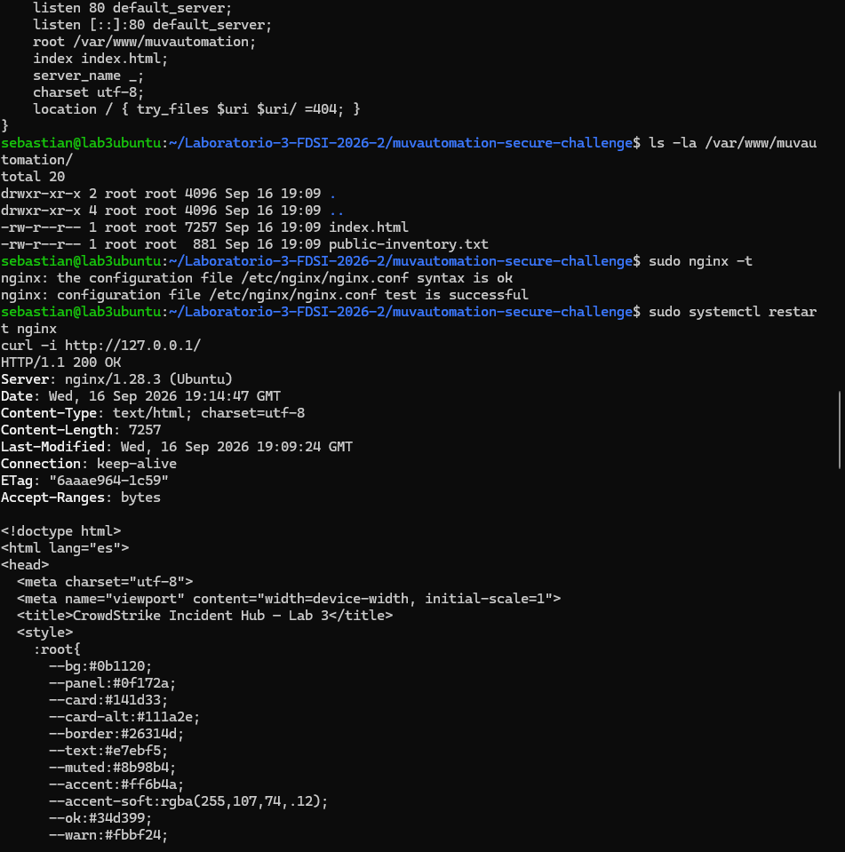

---

## 3. Reconocimiento y ZAP pasivo (Red Team)

```bash
bash scripts/02-red-recon.sh
```

Nmap encontró el puerto 80 abierto con `nginx 1.28.3 (Ubuntu)` — la versión completa, visible en el banner (evidencia guardada en `evidence/red/nmap_port80.nmap`, `curl_home.txt`, `curl_headers.txt`).

Para la parte de ZAP, navegamos el sitio y el archivo `/public-inventory.txt` a través del proxy de ZAP en modo Manual Explore, sin correr Active Scan:

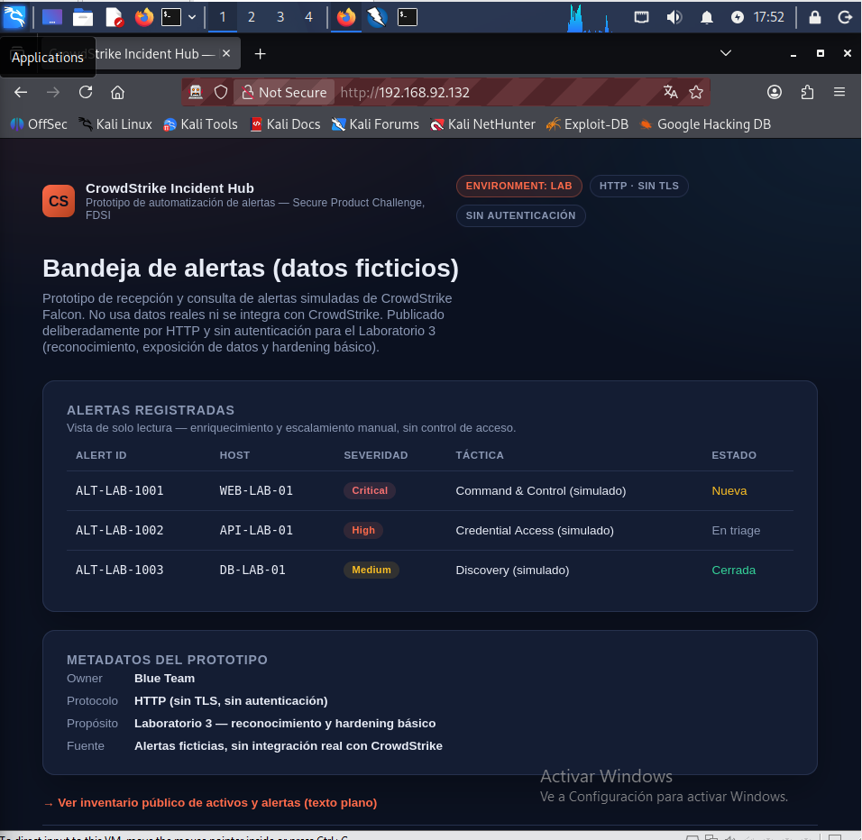

El reporte pasivo terminó con 2 alertas de riesgo medio y 2 de riesgo bajo, ninguna alta — tiene sentido porque en ese punto todavía no habíamos aplicado ningún header de seguridad.

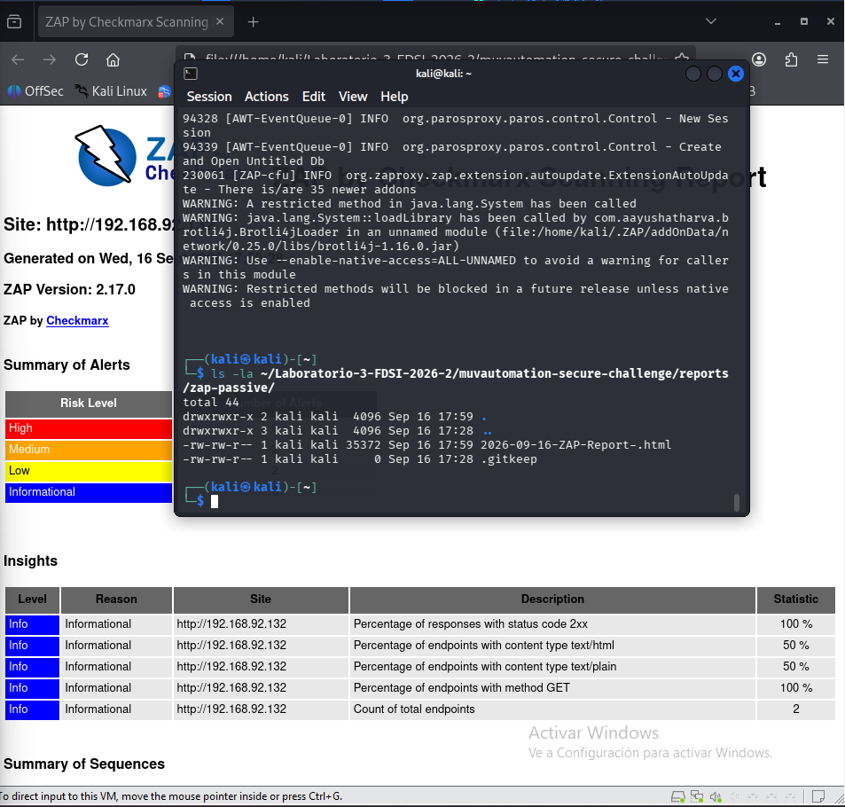

Reporte completo en [`reports/zap-passive/2026-09-16-ZAP-Report-.html`](reports/zap-passive/2026-09-16-ZAP-Report-.html).

---

## 4. Captura de tráfico — la evidencia de H1

```bash
# Ubuntu
bash scripts/03a-blue-capture.sh
# Kali, en los 60 segundos siguientes
bash scripts/03b-red-fetch.sh
```

Esta parte nos costó un par de intentos. La primera vez, Camilo no alcanzó a mandar el `curl` dentro de la ventana de 60 segundos y el tcpdump terminó con 0 paquetes útiles. En el segundo intento, `tcpdump` no pudo escribir el archivo porque había quedado un proceso colgado de la corrida anterior ocupando `/tmp/lab3-http.pcap`. Lo resolvimos matando el proceso y borrando el archivo antes de repetir:

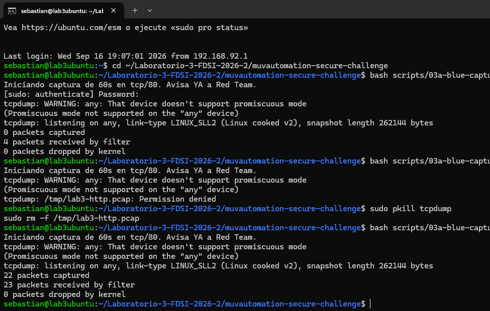

Con el PCAP ya en Kali (traído por `scp`), lo abrimos en Wireshark con el filtro `http`:

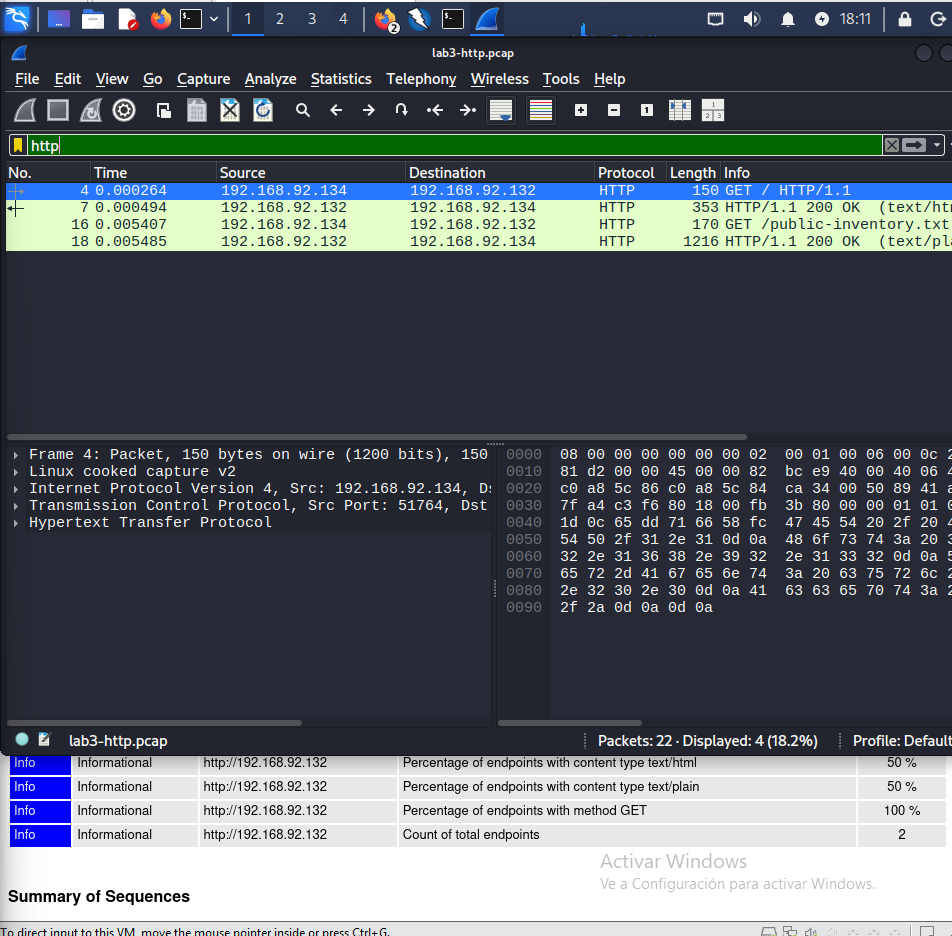

Y aplicando Follow → HTTP Stream sobre la petición al inventario, se lee todo en texto plano — el `User-Agent`, la versión del servidor y el cuerpo completo con las alertas ficticias:

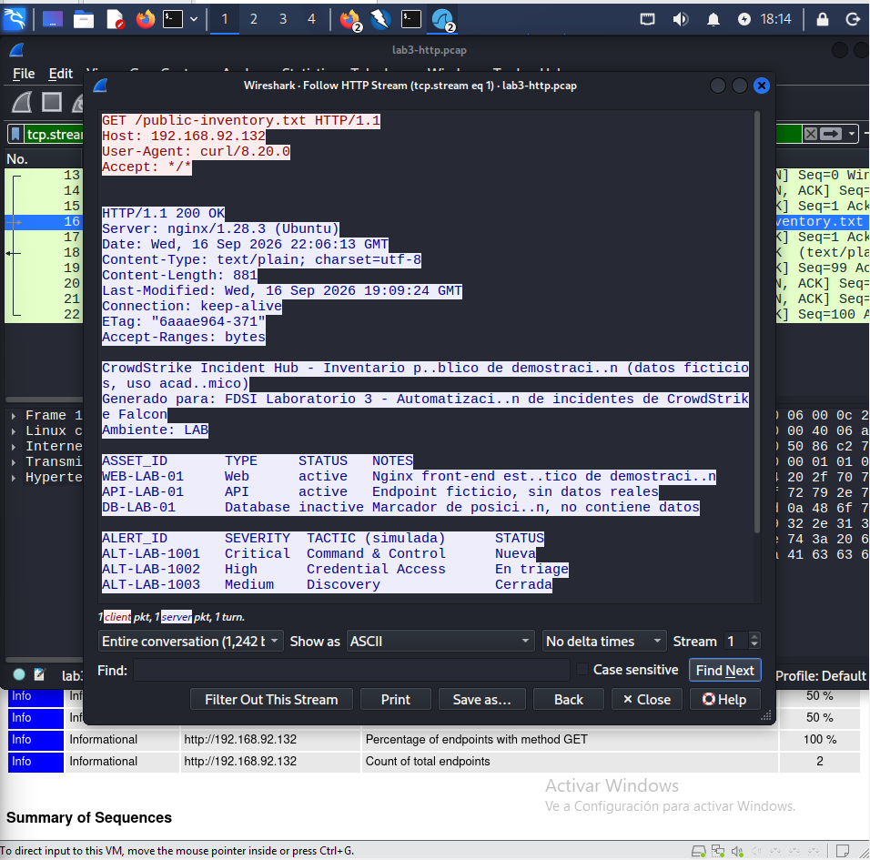

Esta es la prueba más clara de H1: sin TLS, cualquiera que esté en la misma red puede leer exactamente lo mismo que nosotros vemos aquí, sin necesitar ningún exploit.

---

## 5. Detección (Blue Team)

```bash
bash scripts/04-blue-detect.sh
```

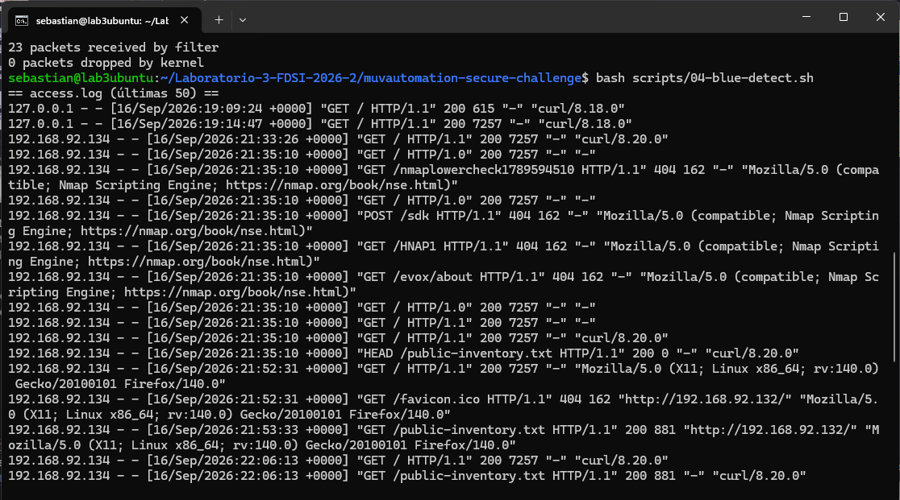

Algo que no esperábamos: las sondas de detección de servicio de Nmap (`-sV`) sí generan peticiones HTTP de verdad y quedan en el log — se ven claritas las rutas típicas que prueba Nmap (`/HNAP1`, `/sdk`, `/evox/about`, `/nmaplowercheck...`), todas con el mismo User-Agent y todas devolviendo 404.

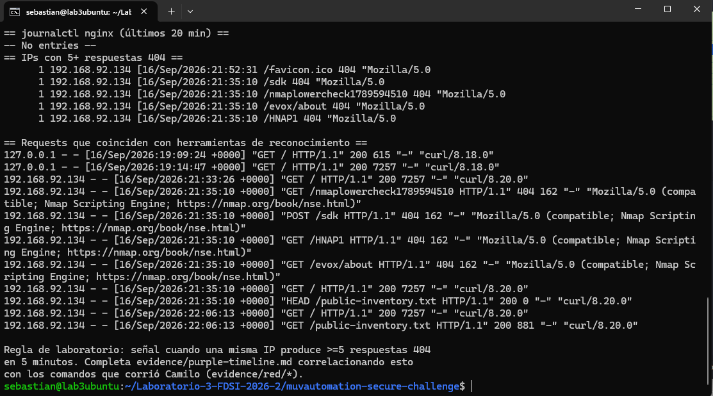

En cambio, `journalctl -u nginx` no mostró nada ("No entries") — esta instalación de Nginx no manda sus logs al journal de systemd, solo escribe en los archivos `access.log`/`error.log`. Es una limitación real que hay que tener presente si uno confía solo en `journalctl` para monitorear.

---

## 6. Corrección y retest

```bash
bash scripts/05-harden-nginx.sh   # Ubuntu
bash scripts/06-retest.sh         # Kali
```

Nos pasó otra vez lo mismo del despliegue: después de aplicar la configuración con hardening, el primer `curl -I` seguía sin mostrar los headers nuevos.

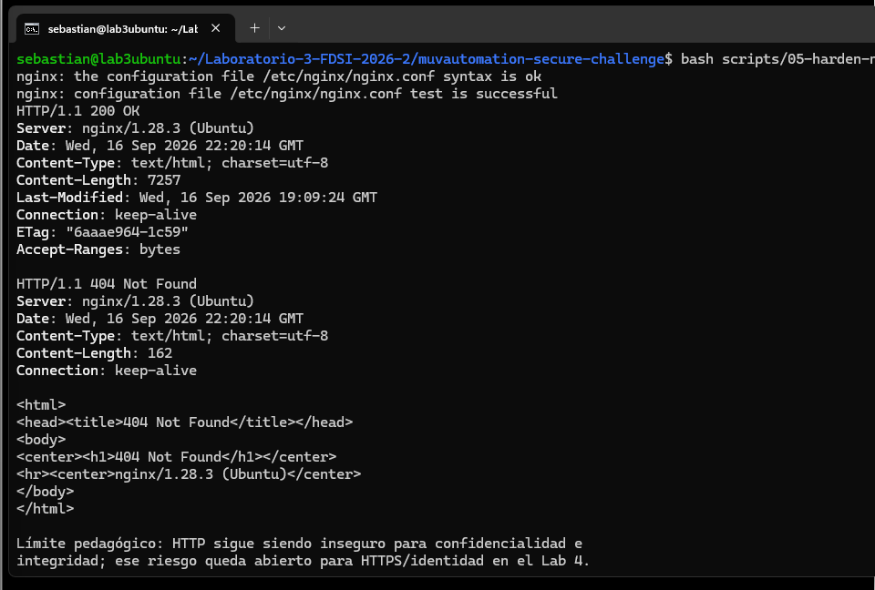

De nuevo, un `systemctl restart` en vez de `reload` resolvió el problema:

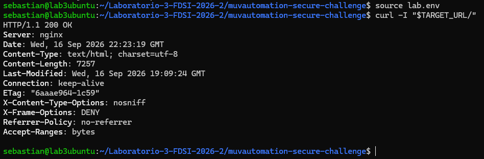

Y desde Kali confirmamos que la ruta oculta ya no responde 200:

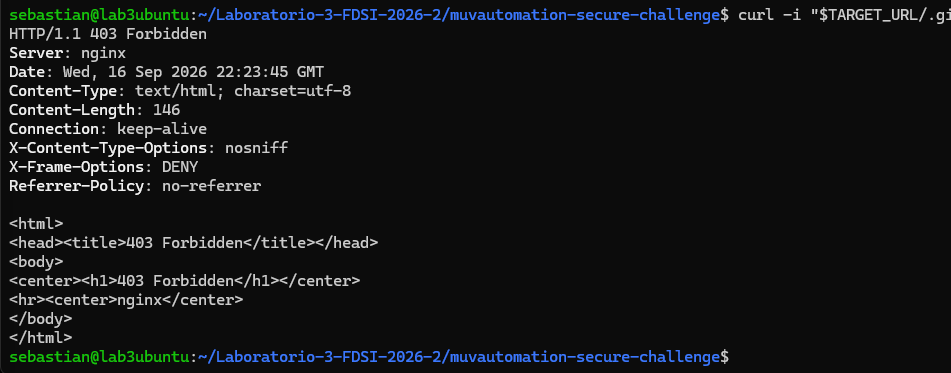

Comparación completa:

| Aspecto | Antes | Después |
|---|---|---|
| Versión de Nginx en Nmap | `nginx 1.28.3 (Ubuntu)` | `nginx` |
| Header `Server` | `nginx/1.28.3 (Ubuntu)` | `nginx` |
| Headers de seguridad | No estaban | `X-Content-Type-Options`, `X-Frame-Options`, `Referrer-Policy` |
| `/.git/config` | No se había probado | `403 Forbidden` |
| Tráfico HTTP en sí | Sin cifrar | Sigue sin cifrar — queda para el Lab 4 |

El hardening arregla la fuga de metadatos, pero no toca el problema de fondo: HTTP sin TLS sigue siendo inseguro para confidencialidad e integridad. Eso queda explícitamente pendiente para el próximo laboratorio.

---

## 7. Línea de tiempo

| Hora UTC | Quién | Qué pasó |
|---|---|---|
| 19:08:08 | Johan | Verificación de línea base |
| 19:09:24 | Johan | Nginx desplegado (después de arreglar el bug del reload) |
| 21:33:26 | Camilo | Primer curl manual de verificación |
| 21:35:10 | Camilo | Nmap + curl del reconocimiento |
| 21:35:10 | Johan | Las sondas de Nmap quedan en el access.log |
| ~21:44–21:53 | Camilo | Exploración con ZAP |
| 22:06:13 | Ambos | Captura de tráfico coordinada |
| 22:15 | Johan | Revisión de logs y regla de detección |
| 22:20 | Johan | Hardening aplicado |
| 22:24:46–22:24:52 | Camilo | Retest completo |

---

## 8. Preguntas de análisis

**¿Qué pudo ver el Red Team sin explotar nada?**
La versión completa de Nginx, todo el HTML de la página y del inventario en texto plano, todos los headers de respuesta, y que no había ningún control de seguridad básico. Todo esto con herramientas normales de reconocimiento — Nmap, curl, ZAP en pasivo, y leyendo el PCAP.

**¿Qué no quedó en el access.log, y por qué?**
El handshake de red que hace Nmap para descubrir el host no deja rastro ahí, porque ese log solo registra peticiones HTTP completas. Lo que sí quedó registrado fueron las sondas de detección de servicio (`-sV`), que sí generan tráfico HTTP real. Tampoco vimos nada en `journalctl -u nginx` — esta instalación no manda los logs de Nginx al journal.

**¿Qué corrige la exposición pero no resuelve el problema de fondo de HTTP?**
`server_tokens off`, los headers de seguridad y bloquear rutas ocultas — todo eso evita que se filtren metadatos, pero el tráfico sigue viajando sin cifrar. Si volviéramos a capturar el PCAP después del hardening, se vería exactamente el mismo contenido en texto plano.

**¿Qué necesitaría Blue Team para distinguir un curl legítimo de algo sospechoso?**
Un solo request no dice nada por sí solo. Haría falta ver la frecuencia por IP en una ventana de tiempo, si las rutas que pide son raras (como las que prueba Nmap), si falta el `Referer` o el `Accept-Language` típico de un navegador, y si esa IP está dentro del rango autorizado del laboratorio.

**¿Qué amenaza STRIDE hay que priorizar para el Lab 4?**
Information Disclosure y Tampering por la falta de TLS — es el único riesgo del registro que quedó explícitamente pendiente para el siguiente laboratorio, y coincide con lo que ese laboratorio va a trabajar (HTTPS, identidad, roles).

**¿Qué conclusión no se pudo comprobar del todo?**
Nunca llegamos a entender por qué `systemctl reload nginx` no aplicaba los cambios de configuración y sí lo hacía `restart` — nos pasó dos veces, en el despliegue y en el hardening, y las dos veces lo resolvimos así sin confirmar la causa exacta.

---

## 9. Riesgos

Detalle completo en [`risk-register.md`](risk-register.md).

| Riesgo | Estado |
|---|---|
| R1 — Tráfico HTTP sin cifrar | Pendiente para Lab 4 |
| R2 — Versión de Nginx expuesta | Corregido |
| R3 — Faltaban headers de seguridad | Corregido |
| R4 — Rutas ocultas accesibles | Corregido |
| R5 — Sin correlación temporal | Mitigado con la línea de tiempo |
| R6 — Sin TLS ante tampering | Aceptado por ahora, pendiente para Lab 4 |

---

## 10. Cómo reproducirlo

Todo el detalle de variables y el orden de scripts está en el [`README.md`](README.md).

**Tag de entrega:** `lab-3`
