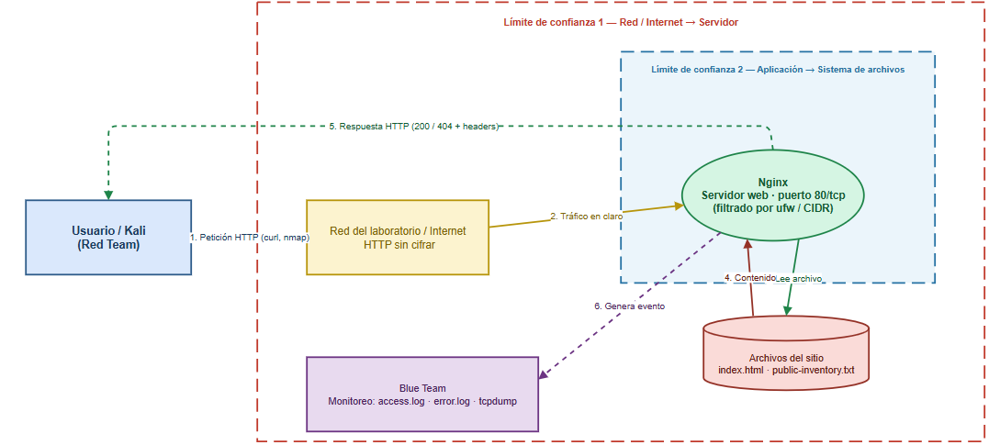

# MuvAutomation Secure Challenge — Lab 3 (HTTP público, Red + Blue Team)

Laboratorio académico autorizado (FDSI). Publica una aplicación web mínima por HTTP,
sin autenticación, sobre una instancia Ubuntu Server, y ejecuta el ciclo completo
**Diseñar → Construir → Atacar → Detectar → Corregir → Verificar**.

## Equipo

- **Johan Sebastián Beltrán Gutiérrez** — Blue Team / Builder (construye y defiende el servidor).
- **Andrés Camilo Vivas Baquero** — Red Team (reconocimiento y validación autorizada).

## Arquitectura

```
Kali Linux (Red Team) --HTTP (tcp/80)--> Red del laboratorio --> Nginx --> /var/www/muvautomation
```



DFD con los dos límites de confianza (red→servidor y aplicación→sistema de archivos) y el flujo de
monitoreo hacia Blue Team. Ver [diagrams/stride-table.md](diagrams/stride-table.md) para las
hipótesis STRIDE (H1–H4) asociadas a cada cruce de límite.

**Alcance obligatorio:** solo se trabaja contra la IP/URL asignada por el docente, dentro de la
ventana de laboratorio autorizada. Palabra de seguridad para detener cualquier prueba: `STOP-LAB`.

## Variables de entorno

```bash
cp lab.env.example lab.env
# editar lab.env con los valores que dé el docente
source lab.env
```

```
export TARGET_IP=IP_ASIGNADA
export TARGET_URL=http://$TARGET_IP
export LAB_CIDR=CIDR_AUTORIZADO
```

`lab.env` no se versiona (ver `.gitignore`) porque contiene la IP real asignada por el docente.

## Procedimiento de reproducción

Cada script corresponde a un paso de la guía oficial. Ejecutar en el orden indicado,
alternando entre la máquina de Johan (Ubuntu Server, por SSH) y la de Camilo (Kali).

| Orden | Script | Quién / dónde | Fase de la guía |
|-------|--------|----------------|------------------|
| 1 | `scripts/00-verify-host.sh` | Johan, Ubuntu | Fase A, Paso 1 |
| 2 | `scripts/01-deploy-nginx.sh` | Johan, Ubuntu | Fase A, Pasos 2–5 |
| — | Modelado DFD + STRIDE (`diagrams/`) | Ambos, juntos | Fase B, Pasos 6–7 |
| 3 | `scripts/02-red-recon.sh` | Camilo, Kali | Fase C, Pasos 8–9 |
| — | OWASP ZAP, Manual Explore | Camilo, Kali | Fase C, Paso 10 |
| 4a | `scripts/03a-blue-capture.sh` | Johan, Ubuntu (arranca primero) | Fase C, Paso 11 |
| 4b | `scripts/03b-red-fetch.sh` | Camilo, Kali (justo después) | Fase C, Paso 11 |
| 5 | `scripts/04-blue-detect.sh` | Johan, Ubuntu | Fase D, Pasos 12–14 |
| 6 | `scripts/05-harden-nginx.sh` | Johan, Ubuntu | Fase E, Pasos 15–16 |
| 7 | `scripts/06-retest.sh` | Camilo, Kali | Fase F, Paso 17 |
| 8 | `git add . && git commit && git tag lab-3` | Ambos | Fase F, Paso 18 |

Antes del paso 3, el docente debe validar la URL, el alcance del firewall y que el contenido
publicado sea completamente ficticio (punto de control de la Fase A).

## Estructura del repositorio

```
muvautomation-secure-challenge/
├── app/                    # Sitio estático publicado (index.html, public-inventory.txt)
├── nginx/                  # Config inicial y config con hardening (Paso 15)
├── diagrams/                # DFD (dfd-lab3.png) + tabla STRIDE
├── scripts/                 # Un script por paso, en orden de ejecución
├── evidence/red/            # Salidas de Nmap/curl/ZAP de la ronda inicial
├── evidence/blue/            # Logs, PCAP y regla de detección
├── evidence/retest/          # Repetición de pruebas tras el hardening
├── reports/zap-passive/      # Reporte HTML exportado de ZAP
├── risk-register.md
├── reflexion-johan.md
├── reflexion-camilo.md
└── README.md
```

## Reglas de seguridad (resumen)

- Solo datos, cuentas y tokens ficticios.
- Sin denegación de servicio, fuerza bruta, explotación destructiva ni persistencia.
- Cada comando conserva timestamp UTC, origen, destino y responsable.
- Anonimizar IP pública, nombres y tokens antes de compartir evidencia con una IA externa.

